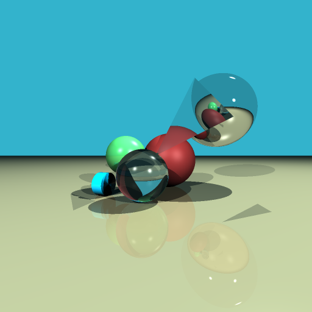

# raytracer

Простая реализация алгоритмов трассировки лучей и трассировки путей на языке C++.

## Сборка и запуск

### Зависимости

- Для векторной математики используется библиотека [glm](https://github.com/g-truc/glm) (header-only, включена в репозиторий)
- Для сохранения изображений в формате bmp используется библиотека [stb](https://github.com/nothings/stb) (header-only, включена в репозиторий)

### Сборка

Для сборки подойдёт любой современный компилятор C++ с поддержкой C++17. В случае использования параллелизма также потребуется поддержка стандарта OpenMP.

Автоматическая сборка:

```
bash build.sh
```

Вручную:

```
mkdir build
cd build
cmake -DCMAKE\_BUILD\_TYPE=Release ..
make -j8
```

### Запуск

Автоматический запуск (рендеринг всех доступных сцен):

```
bash run.sh
```

Вручную (рендеринг одной сцены):

```
./rt [-scene SCENE_NUM (1 - 3)] [-threads NUM_THREADS] [-out RELATIVE_OUT_PATH]
```

По умолчанию загружается сцена 1, обрабатывается на одном потоке и выводится в файл out_1.bmp.

## Реализованные возможности

### Базовая часть (+15)

Реализована в сцене 1, рендеринг на четырёхъядерном процессоре Intel Core i7 4770k занимает менее 0.4 секунд (hyper-threading, 8 потоков).



### Дополнительная часть (+20)

Реализованы следующие функциональные элементы:

- Поддержка 3D-моделей в виде треугольных мешей (от +4). Для ускоренного поиска пересечений для мешей реализована структура данных BVH с использованием кодов Мортона. Реализована в сцене 3, рендеринг на четырёхъядерном процессоре Intel Core i7 4770k занимает менее 2.1 секунд (hyper-threading, 8 потоков).


- Устранение ступенчатости (+1). Реализовано в сценах 1 и 2.

- Использование дополнительных геометрических примитивов (+2). Все 4 (2 базовых и 2 дополнительных) примитива размещены в сцене 1.

Трассировка путей:

- Базовый алгоритм трассировки путей (+5). Реализован в сцене 2, рендеринг на четырёхъядерном процессоре Intel Core i7 4770k занимает менее 42.0 секунд (hyper-threading, 8 потоков).


- Использование гамма-коррекции (+1).

- Источник света в виде меша (+1). В сцене 2 меш содержит только один треугольник, но может содержать произвольное число треугольников.

- Использование модели Ламберта с выборкой по значимости (+3).

- Использование моделей идеального преломления и идеального отражения (+1).

- Использование многопоточности (+2).
